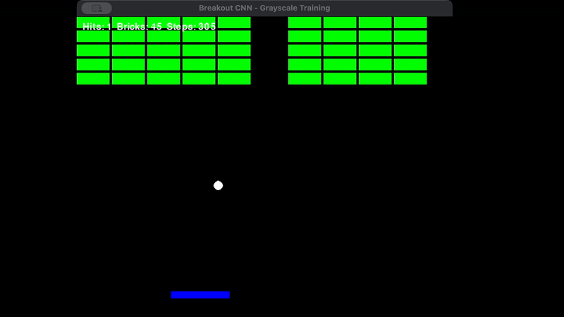

# Breakout AI: Deep Reinforcement Learning with CNN + Frame Stacking


An AI agent that learns to play Breakout from raw pixels using Deep Reinforcement Learning (PPO + CNN)

 

## 🎯 Project Overview

This project demonstrates how to train an AI agent to master the classic Breakout game using:
- **Convolutional Neural Networks (CNN)** for visual processing
- **Frame Stacking** (4 frames) to capture temporal information
- **Proximal Policy Optimization (PPO)** for stable training
- **Reward Shaping** to guide learning

---

## 📁 Project Structure

```
breakout-rl/
├── breakout_env.py          # Custom Breakout environment (84x84 grayscale)
├── train_cnn.py             # Main training script with PPO
├── visualize_agent.py       # Visualization tool for trained agents
├── test_cnn_stable.py       # Testing and evaluation script
├── requirements.txt         # Python dependencies
├── README.md               # This file
│
├── checkpoints_cnn_stable/  # Training checkpoints (saved every 50k steps)
├── best_model_cnn_stable/   # Best performing model
├── tensorboard_cnn_stable/  # TensorBoard logs
└── logs_cnn_stable/         # Evaluation logs
```

---

## 🚀 Quick Start

### 1. Installation

```bash
# Clone repository
git clone https://github.com/Winter-Shade/breakout-rl.git
cd breakout-rl

# Create virtual environment
python -m venv .venv
source .venv/bin/activate  # On Windows: .venv\Scripts\activate

# Install dependencies
pip install -r requirements.txt
```

### 2. Train the Agent

```bash
# Start training (2M timesteps, ~4-6 hours on GPU)
python train_cnn.py

# Monitor training in another terminal
tensorboard --logdir ./tensorboard_cnn_stable/
# Open: http://localhost:6006
```

### 3. Visualize the Trained Agent

```bash
# Watch the agent play 
python visualize_agent.py --model ppo_breakout_cnn_1200000_steps --episodes 5

# Or use the best model
python visualize_agent.py --model best_model_cnn_stable/best_model --episodes 10
```

### 4. Evaluate Performance

```bash
# Test on 50 episodes
python test_cnn_stable.py --model ppo_breakout_cnn_stable_final --episodes 50

# Compare multiple checkpoints
python test_cnn_stable.py --compare
```

---

## 🏗️ Technical Architecture

### Environment Specifications

**State Space:**
- **Dimensions:** 84×84×1 (grayscale images)
- **Stacked Frames:** 4 consecutive frames
- **Total Input:** 4×84×84 = 28,224 pixels
- **Theoretical State Space Size:** 256^28,224 possible states

**Action Space:**
- **Size:** 3 discrete actions
  - 0: Stay (no movement)
  - 1: Move Left
  - 2: Move Right

**Observation Processing:**
1. Render game at 640×480 (native resolution)
2. Convert RGB to grayscale (luminosity method)
3. Resize to 84×84 (standard Atari preprocessing)
4. Stack 4 consecutive frames for temporal information

### Neural Network Architecture

```
Input: 4×84×84 (4 stacked grayscale frames)
    ↓
Conv1: 32 filters, 8×8 kernel, stride 4 → (32, 20, 20)
    ↓ ReLU
Conv2: 64 filters, 4×4 kernel, stride 2 → (64, 9, 9)
    ↓ ReLU
Conv3: 64 filters, 3×3 kernel, stride 1 → (64, 7, 7)
    ↓ ReLU + Flatten
Fully Connected: 512 units
    ↓
Split:
    ├─ Actor (Policy): 512 → 3 actions
    └─ Critic (Value): 512 → 1 value estimate

```

### Reward Structure

| Event | Reward | Purpose |
|-------|--------|---------|
| Paddle Hit | +5.0 + streak bonus | Encourage ball control |
| Brick Destroyed | +1.0 | Learn objective |
| Ball Missed | -10.0 | Avoid losing |
| Game Won | +100.0 | Terminal goal |
| Distance Shaping | +0.1 | Guide paddle alignment |
| Survival | +0.01/step | Prevent giving up |

### Training Configuration

```python
Algorithm: PPO (Proximal Policy Optimization)
Learning Rate: 1e-4
Batch Size: 512
Buffer Size: 512 steps per update
Discount Factor (γ): 0.99
GAE Lambda (λ): 0.95
Clip Range (ε): 0.1
Entropy Coefficient: 0.01
Value Function Coefficient: 0.5
Gradient Clipping: 0.5
Reward Normalization: Enabled
```

---

## 🎓 Key Implementation Details

### 1. Frame Stacking

**Problem:** Single frames don't show motion
```python
observation = [4×84×84 images]  
```
Stack 4 consecutive frames to make trajectory visible
- Frame t-3, t-2, t-1, t (current)
- CNN learns motion patterns from frame differences

### 2. Reward Normalization

**Problem:** Rewards range from -10 to +100 → Value function instability

**Solution:** Normalize rewards to mean ≈ 0, std ≈ 1
```python
normalized_reward = (reward - running_mean) / running_std
```

**Result:** Stable training, no catastrophic forgetting

### 3. Curriculum Learning

The environment implements progressive difficulty:
- **80% easy starts:** Ball near paddle, moving upward
- **20% hard starts:** Ball coming down from top
- **Speed increase:** Ball speeds up after 5+ consecutive hits

---


## 📈 Monitoring Training

### TensorBoard 

```bash
tensorboard --logdir ./tensorboard_cnn_stable/
```

**Key metrics to watch:**
- `rollout/ep_rew_mean`: Should steadily increase
- `train/value_loss`: Should decrease and stabilize
- `train/explained_variance`: Should be high (0.7-0.9)

---

## Experiments & Variations

### Try Different Reward Structures

```python
# In breakout_env.py, modify step() method:
base_reward = 3.0  # Change paddle reward
reward += 2.0      # Change brick reward
```

### Test Different Network Architectures

```python
policy_kwargs=dict(
    net_arch=[512, 512],     # Different hidden layers
    activation_fn=th.nn.Tanh,  # Different activation
)
```

---

## 📚 References & Resources

### Papers
- [PPO (2017)](https://arxiv.org/abs/1707.06347) - Schulman et al., "Proximal Policy Optimization Algorithms"
- [DQN (2015)](https://www.nature.com/articles/nature14236) - Mnih et al., "Human-level control through deep reinforcement learning"

### Libraries & Frameworks
- [Stable-Baselines3](https://stable-baselines3.readthedocs.io/)
- [Gymnasium](https://gymnasium.farama.org/) 
- [PyTorch](https://pytorch.org/) 

---


